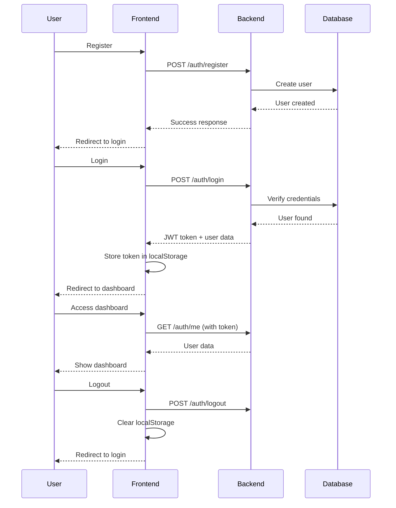

# Backend API Integration Guide

This guide explains how to integrate your backend API with this Next.js frontend.

## 🎯 Overview

The frontend communicates with your backend through REST API calls. All API logic is centralized in `lib/api.ts`.

## 📡 API Endpoints Required

Your backend must implement these 4 endpoints:

### 1. User Registration

```
POST {API_URL}/auth/register
```

**Request Body:**
```json
{
  "name": "John Doe",
  "email": "john@example.com",
  "password": "securepassword123"
}
```

**Success Response (201):**
```json
{
  "success": true,
  "user": {
    "id": "user-123",
    "name": "John Doe",
    "email": "john@example.com"
  }
}
```

**Error Response (400/409):**
```json
{
  "success": false,
  "error": "User with this email already exists"
}
```

### 2. User Login

```
POST {API_URL}/auth/login
```

**Request Body:**
```json
{
  "email": "john@example.com",
  "password": "securepassword123"
}
```

**Success Response (200):**
```json
{
  "success": true,
  "token": "eyJhbGciOiJIUzI1NiIsInR5cCI6IkpXVCJ9...",
  "user": {
    "id": "user-123",
    "name": "John Doe",
    "email": "john@example.com"
  }
}
```

**Error Response (401):**
```json
{
  "success": false,
  "error": "Invalid email or password"
}
```

### 3. Get Current User

```
GET {API_URL}/auth/me
```

**Request Headers:**
```
Authorization: Bearer {JWT_TOKEN}
```

**Success Response (200):**
```json
{
  "user": {
    "id": "user-123",
    "name": "John Doe",
    "email": "john@example.com"
  }
}
```

**Error Response (401):**
```json
{
  "error": "Invalid or expired token"
}
```

### 4. User Logout

```
POST {API_URL}/auth/logout
```

**Request Headers:**
```
Authorization: Bearer {JWT_TOKEN}
```

**Success Response (200):**
```json
{
  "success": true
}
```

## 🔐 Authentication Flow



## 🛠️ Backend Implementation Examples

### Node.js + Express

```javascript
const express = require('express');
const cors = require('cors');
const jwt = require('jsonwebtoken');
const bcrypt = require('bcryptjs');

const app = express();

// Enable CORS
app.use(cors({
  origin: 'http://localhost:3000',
  credentials: true
}));

app.use(express.json());

// Register endpoint
app.post('/backend_api/auth/register', async (req, res) => {
  const { name, email, password } = req.body;
  
  // Check if user exists
  const existingUser = await User.findOne({ email });
  if (existingUser) {
    return res.status(409).json({
      success: false,
      error: 'User with this email already exists'
    });
  }
  
  // Hash password
  const hashedPassword = await bcrypt.hash(password, 10);
  
  // Create user
  const user = await User.create({
    name,
    email,
    password: hashedPassword
  });
  
  res.status(201).json({
    success: true,
    user: {
      id: user._id,
      name: user.name,
      email: user.email
    }
  });
});

// Login endpoint
app.post('/backend_api/auth/login', async (req, res) => {
  const { email, password } = req.body;
  
  // Find user
  const user = await User.findOne({ email });
  if (!user) {
    return res.status(401).json({
      success: false,
      error: 'Invalid email or password'
    });
  }
  
  // Verify password
  const isValid = await bcrypt.compare(password, user.password);
  if (!isValid) {
    return res.status(401).json({
      success: false,
      error: 'Invalid email or password'
    });
  }
  
  // Generate token
  const token = jwt.sign(
    { userId: user._id },
    process.env.JWT_SECRET,
    { expiresIn: '7d' }
  );
  
  res.json({
    success: true,
    token,
    user: {
      id: user._id,
      name: user.name,
      email: user.email
    }
  });
});

// Get current user endpoint
app.get('/backend_api/auth/me', async (req, res) => {
  const token = req.headers.authorization?.replace('Bearer ', '');
  
  if (!token) {
    return res.status(401).json({ error: 'No token provided' });
  }
  
  try {
    const decoded = jwt.verify(token, process.env.JWT_SECRET);
    const user = await User.findById(decoded.userId);
    
    if (!user) {
      return res.status(401).json({ error: 'User not found' });
    }
    
    res.json({
      user: {
        id: user._id,
        name: user.name,
        email: user.email
      }
    });
  } catch (error) {
    res.status(401).json({ error: 'Invalid token' });
  }
});

// Logout endpoint
app.post('/backend_api/auth/logout', (req, res) => {
  // For JWT, logout is handled client-side
  // You can implement token blacklisting here if needed
  res.json({ success: true });
});

app.listen(5000, () => {
  console.log('Backend running on http://localhost:5000');
});
```

### Python + Flask

```python
from flask import Flask, request, jsonify
from flask_cors import CORS
import jwt
import bcrypt
from datetime import datetime, timedelta

app = Flask(__name__)
CORS(app, origins=['http://localhost:3000'])

@app.route('/backend_api/auth/register', methods=['POST'])
def register():
    data = request.json
    name = data.get('name')
    email = data.get('email')
    password = data.get('password')
    
    # Check if user exists
    existing_user = User.query.filter_by(email=email).first()
    if existing_user:
        return jsonify({
            'success': False,
            'error': 'User with this email already exists'
        }), 409
    
    # Hash password
    hashed = bcrypt.hashpw(password.encode('utf-8'), bcrypt.gensalt())
    
    # Create user
    user = User(name=name, email=email, password=hashed)
    db.session.add(user)
    db.session.commit()
    
    return jsonify({
        'success': True,
        'user': {
            'id': user.id,
            'name': user.name,
            'email': user.email
        }
    }), 201

@app.route('/backend_api/auth/login', methods=['POST'])
def login():
    data = request.json
    email = data.get('email')
    password = data.get('password')
    
    # Find user
    user = User.query.filter_by(email=email).first()
    if not user:
        return jsonify({
            'success': False,
            'error': 'Invalid email or password'
        }), 401
    
    # Verify password
    if not bcrypt.checkpw(password.encode('utf-8'), user.password):
        return jsonify({
            'success': False,
            'error': 'Invalid email or password'
        }), 401
    
    # Generate token
    token = jwt.encode({
        'userId': user.id,
        'exp': datetime.utcnow() + timedelta(days=7)
    }, app.config['JWT_SECRET'])
    
    return jsonify({
        'success': True,
        'token': token,
        'user': {
            'id': user.id,
            'name': user.name,
            'email': user.email
        }
    })

@app.route('/backend_api/auth/me', methods=['GET'])
def get_current_user():
    token = request.headers.get('Authorization', '').replace('Bearer ', '')
    
    if not token:
        return jsonify({'error': 'No token provided'}), 401
    
    try:
        decoded = jwt.decode(token, app.config['JWT_SECRET'], algorithms=['HS256'])
        user = User.query.get(decoded['userId'])
        
        if not user:
            return jsonify({'error': 'User not found'}), 401
        
        return jsonify({
            'user': {
                'id': user.id,
                'name': user.name,
                'email': user.email
            }
        })
    except:
        return jsonify({'error': 'Invalid token'}), 401

@app.route('/backend_api/auth/logout', methods=['POST'])
def logout():
    return jsonify({'success': True})

if __name__ == '__main__':
    app.run(port=5000)
```

## 🔧 CORS Configuration

Your backend MUST enable CORS to allow the frontend to make requests:

### Express (Node.js)
```javascript
const cors = require('cors');
app.use(cors({
  origin: 'http://localhost:3000',  // Frontend URL
  credentials: true
}));
```

### Flask (Python)
```python
from flask_cors import CORS
CORS(app, origins=['http://localhost:3000'])
```

### Django (Python)
```python
# settings.py
CORS_ALLOWED_ORIGINS = [
    "http://localhost:3000",
]
```

## ⚙️ Frontend Configuration

Update `.env.local`:

```env
NEXT_PUBLIC_API_URL=http://localhost:5000/backend_api
NEXT_PUBLIC_USE_DUMMY_DATA=false
```

## 🧪 Testing Your Backend

### Using curl

**Register:**
```bash
curl -X POST http://localhost:5000/backend_api/auth/register \
  -H "Content-Type: application/json" \
  -d '{"name":"Test User","email":"test@example.com","password":"password123"}'
```

**Login:**
```bash
curl -X POST http://localhost:5000/backend_api/auth/login \
  -H "Content-Type: application/json" \
  -d '{"email":"test@example.com","password":"password123"}'
```

**Get Current User:**
```bash
curl -X GET http://localhost:5000/backend_api/auth/me \
  -H "Authorization: Bearer YOUR_JWT_TOKEN"
```

### Using Postman

1. Create a new collection
2. Add requests for each endpoint
3. Set headers and body as shown above
4. Test each endpoint

## 🔒 Security Checklist

- [ ] Validate all input data
- [ ] Hash passwords with bcrypt (10+ rounds)
- [ ] Use secure JWT secrets
- [ ] Set appropriate token expiration
- [ ] Enable HTTPS in production
- [ ] Implement rate limiting
- [ ] Add request validation
- [ ] Sanitize user input
- [ ] Use parameterized queries
- [ ] Enable CORS only for your domain

## 📊 Response Status Codes

| Code | Meaning | When to Use |
|------|---------|-------------|
| 200 | OK | Successful login, get user |
| 201 | Created | Successful registration |
| 400 | Bad Request | Invalid input data |
| 401 | Unauthorized | Invalid credentials or token |
| 409 | Conflict | User already exists |
| 500 | Server Error | Internal server error |

## 🐛 Debugging

### Check if backend is running
```bash
curl http://localhost:5000/backend_api/auth/me
```

### Enable detailed logging
```javascript
// In lib/api.ts
console.log('API Request:', method, url, body);
console.log('API Response:', data);
```

### Check browser console
Open DevTools → Console → Network tab
- See all API requests
- Check response data
- View error messages

## 📝 Adding Custom Endpoints

To add new endpoints:

1. **Add to backend**
```javascript
app.get('/backend_api/users/profile', authenticate, (req, res) => {
  // Your logic
});
```

2. **Add to frontend** (`lib/api.ts`)
```typescript
async getUserProfile(): Promise<any> {
  const token = localStorage.getItem('auth-token');
  const response = await fetch(`${API_URL}/users/profile`, {
    headers: { 'Authorization': `Bearer ${token}` }
  });
  return response.json();
}
```

3. **Use in component**
```typescript
const profile = await apiService.getUserProfile();
```

## ✅ Integration Checklist

- [ ] Backend server running
- [ ] All 4 endpoints implemented
- [ ] CORS configured
- [ ] JWT secret set
- [ ] Database connected
- [ ] `.env.local` configured in frontend
- [ ] `NEXT_PUBLIC_USE_DUMMY_DATA=false`
- [ ] Test registration
- [ ] Test login
- [ ] Test protected route
- [ ] Test logout

---

**Questions?** Check the main README.md or create an issue!
