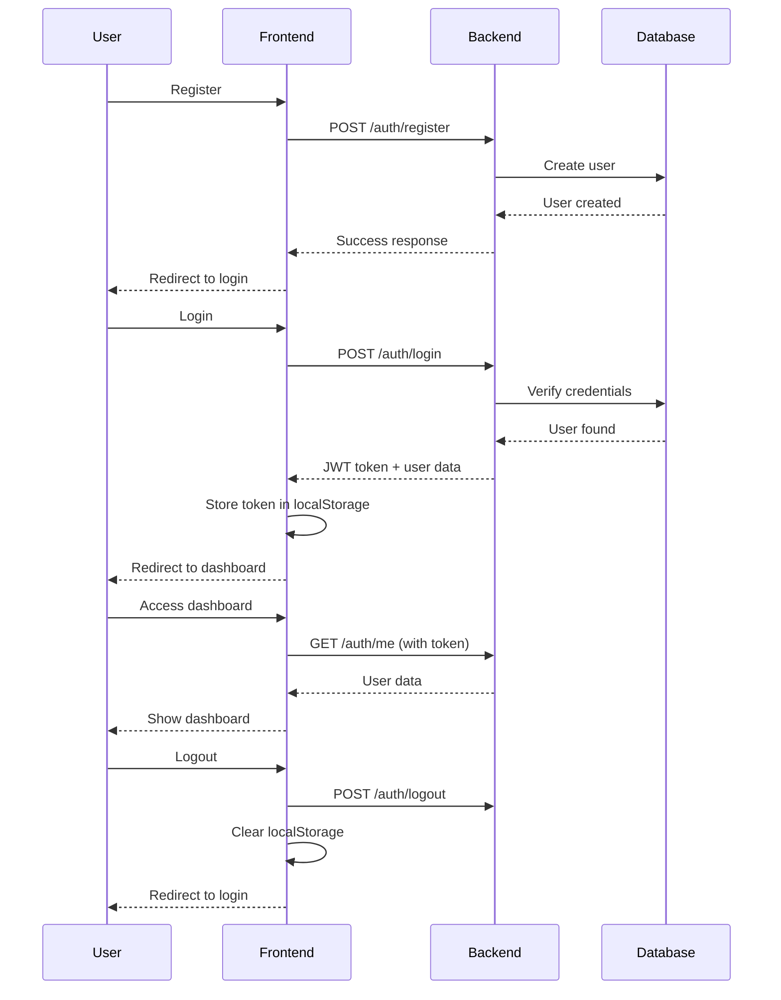

# Next.js Authentication Starter (Frontend Only)

A frontend-focused Next.js 15 authentication starter with TypeScript and Tailwind CSS. This project is designed to work with a backend API while providing dummy data support for development without a backend server.

## 🎯 Key Features

- ✨ **Next.js 15** with App Router
- 🔐 **Complete Authentication Pages**
  - User registration
  - User login
  - Protected dashboard
- 🔄 **Dual Mode Operation**
  - **Dummy Data Mode**: Works without backend (localStorage)
  - **API Mode**: Connects to your backend server
- 🎨 **Tailwind CSS** for styling
- 🌙 **Dark mode** support (automatic)
- 📱 **Responsive design**
- 🎯 **TypeScript** for type safety
- 🚀 **Modern UI/UX** with smooth transitions

## 📦 Project Structure

```
nextjs-auth-starter/
├── app/
│   ├── login/
│   │   └── page.tsx           # Login page
│   ├── register/
│   │   └── page.tsx           # Registration page
│   ├── dashboard/
│   │   └── page.tsx           # Protected dashboard page
│   ├── layout.tsx             # Root layout
│   ├── page.tsx               # Home page
│   └── globals.css            # Global styles with Tailwind
├── lib/
│   └── api.ts                 # API service with dummy data toggle
├── public/                    # Static assets
├── .env.example               # Environment variables template
├── .env.local                 # Your local environment config
├── .gitignore                 # Git ignore rules
├── package.json               # Dependencies and scripts
├── tsconfig.json              # TypeScript configuration
├── tailwind.config.ts         # Tailwind CSS configuration
└── README.md                  # This file
```

## 🚀 Getting Started

### Prerequisites

- Node.js 18+ installed
- npm, yarn, or pnpm package manager

### Installation

1. **Install dependencies**

```bash
npm install
# or
yarn install
# or
pnpm install
```

2. **Configure environment variables**

Copy the `.env.example` file to `.env.local`:

```bash
cp .env.example .env.local
```

Edit `.env.local`:

```env
# API Configuration
NEXT_PUBLIC_API_URL=http://localhost:5000/backend_api

# Use dummy data (true) or real API (false)
NEXT_PUBLIC_USE_DUMMY_DATA=true
```

3. **Run the development server**

```bash
npm run dev
# or
yarn dev
# or
pnpm dev
```

4. **Open your browser**

Navigate to [http://localhost:3000](http://localhost:3000)

## 🔄 Switching Between Dummy Data and Real API

### Using Dummy Data (No Backend Required)

Set in `.env.local`:

```env
NEXT_PUBLIC_USE_DUMMY_DATA=true
```

**Features:**

- ✅ Full authentication flow works
- ✅ Data stored in browser localStorage
- ✅ Simulates network delays
- ✅ Perfect for frontend development
- ⚠️ Data resets when localStorage is cleared

### Using Real Backend API

Set in `.env.local`:

```env
NEXT_PUBLIC_USE_DUMMY_DATA=false
NEXT_PUBLIC_API_URL=http://your-backend-url/backend_api
```

**Required Backend Endpoints:**

Your backend should provide these endpoints:

```
POST /backend_api/auth/register
Body: { name: string, email: string, password: string }
Response: { success: boolean, user: { id, name, email }, error?: string }

POST /backend_api/auth/login
Body: { email: string, password: string }
Response: { success: boolean, user: { id, name, email }, token: string, error?: string }

POST /backend_api/auth/logout
Headers: Authorization: Bearer <token>
Response: { success: boolean }

GET /backend_api/auth/me
Headers: Authorization: Bearer <token>
Response: { user: { id, name, email } }
```

## 📖 Usage Guide

### Registration Flow

1. Navigate to `/register`
2. Fill in name, email, and password
3. Submit the form
4. **Dummy Mode**: User stored in localStorage
5. **API Mode**: User created in backend database
6. Redirected to login page

### Login Flow

1. Navigate to `/login`
2. Enter email and password
3. Submit the form
4. **Dummy Mode**: Credentials checked against localStorage
5. **API Mode**: Credentials sent to backend
6. On success, JWT token stored in localStorage
7. Redirected to dashboard

### Dashboard Access

1. Protected route - requires authentication
2. Automatically checks for valid token
3. Redirects to login if not authenticated
4. Displays user information
5. Shows mock statistics and activity
6. Logout button available

## 🎨 Customization

### Changing API Endpoints

Edit `lib/api.ts` to modify the endpoint paths:

```typescript
// Change from /auth/login to /user/login
const response = await fetch(`${API_URL}/user/login`, {
  // ...
});
```

### Styling

All styling is done with Tailwind CSS:

- Modify colors in `tailwind.config.ts`
- Update global styles in `app/globals.css`
- Change component styles using Tailwind utility classes

### Adding New Fields

To add fields to user registration:

1. Update the form in `app/register/page.tsx`
2. Update the API call in `lib/api.ts`
3. Update the User interface in `lib/api.ts`

```typescript
export interface User {
  id: string;
  name: string;
  email: string;
  phone?: string; // Add new field
}
```

## 🔐 Authentication Flow

```
┌─────────────────────────────────────────────────────┐
│                                                     │
│  User registers → API call → Response               │
│                                                     │
│  User logs in → API call → JWT token received      │
│                                                     │
│  Token stored in localStorage                       │
│                                                     │
│  Protected routes check token                       │
│                                                     │
│  API requests include token in Authorization header │
│                                                     │
│  User logs out → Token removed from localStorage    │
│                                                     │
└─────────────────────────────────────────────────────┘
```

## 📱 Pages Overview

### Home Page (`/`)

- Landing page with navigation
- Shows API mode indicator
- Links to login and register

### Login Page (`/login`)

- Email and password form
- Form validation
- Error handling
- Remember me option
- Link to register

### Register Page (`/register`)

- Name, email, password fields
- Password confirmation
- Client-side validation
- Link to login

### Dashboard (`/dashboard`)

- Protected route
- User welcome message
- Statistics cards (dummy data)
- Recent activity feed (dummy data)
- Logout functionality

## 🔧 API Service (`lib/api.ts`)

The `apiService` object provides these methods:

```typescript
// Register a new user
await apiService.register(name, email, password);

// Login a user
await apiService.login(email, password);

// Logout current user
await apiService.logout();

// Get current user
await apiService.getCurrentUser();

// Check if user is authenticated
apiService.isAuthenticated();

// Get stored user data
apiService.getStoredUser();
```

## 🌐 Environment Variables

| Variable                     | Description            | Example                             |
| ---------------------------- | ---------------------- | ----------------------------------- |
| `NEXT_PUBLIC_API_URL`        | Backend API base URL   | `http://localhost:5000/backend_api` |
| `NEXT_PUBLIC_USE_DUMMY_DATA` | Toggle dummy data mode | `true` or `false`                   |

## 🛠️ Scripts

```bash
# Development server
npm run dev

# Production build
npm run build

# Start production server
npm run start

# Run linter
npm run lint
```

## 🎯 Backend Integration Checklist

When you're ready to connect to a real backend:

- [ ] Set up your backend API server
- [ ] Implement the required authentication endpoints
- [ ] Update `NEXT_PUBLIC_API_URL` in `.env.local`
- [ ] Set `NEXT_PUBLIC_USE_DUMMY_DATA=false`
- [ ] Test registration flow
- [ ] Test login flow
- [ ] Test token validation
- [ ] Test logout flow
- [ ] Configure CORS on your backend
- [ ] Set up proper error handling

## 🔒 Security Considerations

### Current Implementation (Development)

- ✅ Client-side validation
- ✅ Password confirmation
- ✅ Token-based authentication
- ✅ Protected routes

### Production Requirements

- ⚠️ Use HTTPS only
- ⚠️ Implement CSRF protection
- ⚠️ Add rate limiting
- ⚠️ Secure token storage (httpOnly cookies recommended)
- ⚠️ Implement refresh tokens
- ⚠️ Add input sanitization
- ⚠️ Enable Content Security Policy
- ⚠️ Regular security audits

## 🚀 Deployment

### Vercel (Recommended)

1. Push your code to GitHub
2. Import your repository in Vercel
3. Add environment variables:
   - `NEXT_PUBLIC_API_URL`: Your backend API URL
   - `NEXT_PUBLIC_USE_DUMMY_DATA`: Set to `false`
4. Deploy!

### Other Platforms

Works on any platform that supports Next.js:

- Netlify
- Railway
- Render
- AWS Amplify
- Google Cloud
- Azure

**Important**: Always set environment variables in your deployment platform.

## 🤝 Contributing

Contributions are welcome! Feel free to:

- Report bugs
- Suggest new features
- Submit pull requests

## 📄 License

MIT License - feel free to use this starter for your projects!

api integration

# Backend API Integration Guide

This guide explains how to integrate your backend API with this Next.js frontend.

## 🎯 Overview

The frontend communicates with your backend through REST API calls. All API logic is centralized in `lib/api.ts`.

## 📡 API Endpoints Required

Your backend must implement these 4 endpoints:

### 1. User Registration

```
POST {API_URL}/auth/register
```

**Request Body:**

```json
{
  "name": "John Doe",
  "email": "john@example.com",
  "password": "securepassword123"
}
```

**Success Response (201):**

```json
{
  "success": true,
  "user": {
    "id": "user-123",
    "name": "John Doe",
    "email": "john@example.com"
  }
}
```

**Error Response (400/409):**

```json
{
  "success": false,
  "error": "User with this email already exists"
}
```

### 2. User Login

```
POST {API_URL}/auth/login
```

**Request Body:**

```json
{
  "email": "john@example.com",
  "password": "securepassword123"
}
```

**Success Response (200):**

```json
{
  "success": true,
  "token": "eyJhbGciOiJIUzI1NiIsInR5cCI6IkpXVCJ9...",
  "user": {
    "id": "user-123",
    "name": "John Doe",
    "email": "john@example.com"
  }
}
```

**Error Response (401):**

```json
{
  "success": false,
  "error": "Invalid email or password"
}
```

### 3. Get Current User

```
GET {API_URL}/auth/me
```

**Request Headers:**

```
Authorization: Bearer {JWT_TOKEN}
```

**Success Response (200):**

```json
{
  "user": {
    "id": "user-123",
    "name": "John Doe",
    "email": "john@example.com"
  }
}
```

**Error Response (401):**

```json
{
  "error": "Invalid or expired token"
}
```

### 4. User Logout

```
POST {API_URL}/auth/logout
```

**Request Headers:**

```
Authorization: Bearer {JWT_TOKEN}
```

**Success Response (200):**

```json
{
  "success": true
}
```

## 🔐 Authentication Flow



## 🛠️ Backend Implementation Examples

### Node.js + Express

```javascript
const express = require("express");
const cors = require("cors");
const jwt = require("jsonwebtoken");
const bcrypt = require("bcryptjs");

const app = express();

// Enable CORS
app.use(
  cors({
    origin: "http://localhost:3000",
    credentials: true,
  }),
);

app.use(express.json());

// Register endpoint
app.post("/backend_api/auth/register", async (req, res) => {
  const { name, email, password } = req.body;

  // Check if user exists
  const existingUser = await User.findOne({ email });
  if (existingUser) {
    return res.status(409).json({
      success: false,
      error: "User with this email already exists",
    });
  }

  // Hash password
  const hashedPassword = await bcrypt.hash(password, 10);

  // Create user
  const user = await User.create({
    name,
    email,
    password: hashedPassword,
  });

  res.status(201).json({
    success: true,
    user: {
      id: user._id,
      name: user.name,
      email: user.email,
    },
  });
});

// Login endpoint
app.post("/backend_api/auth/login", async (req, res) => {
  const { email, password } = req.body;

  // Find user
  const user = await User.findOne({ email });
  if (!user) {
    return res.status(401).json({
      success: false,
      error: "Invalid email or password",
    });
  }

  // Verify password
  const isValid = await bcrypt.compare(password, user.password);
  if (!isValid) {
    return res.status(401).json({
      success: false,
      error: "Invalid email or password",
    });
  }

  // Generate token
  const token = jwt.sign({ userId: user._id }, process.env.JWT_SECRET, {
    expiresIn: "7d",
  });

  res.json({
    success: true,
    token,
    user: {
      id: user._id,
      name: user.name,
      email: user.email,
    },
  });
});

// Get current user endpoint
app.get("/backend_api/auth/me", async (req, res) => {
  const token = req.headers.authorization?.replace("Bearer ", "");

  if (!token) {
    return res.status(401).json({ error: "No token provided" });
  }

  try {
    const decoded = jwt.verify(token, process.env.JWT_SECRET);
    const user = await User.findById(decoded.userId);

    if (!user) {
      return res.status(401).json({ error: "User not found" });
    }

    res.json({
      user: {
        id: user._id,
        name: user.name,
        email: user.email,
      },
    });
  } catch (error) {
    res.status(401).json({ error: "Invalid token" });
  }
});

// Logout endpoint
app.post("/backend_api/auth/logout", (req, res) => {
  // For JWT, logout is handled client-side
  // You can implement token blacklisting here if needed
  res.json({ success: true });
});

app.listen(5000, () => {
  console.log("Backend running on http://localhost:5000");
});
```

### Python + Flask

```python
from flask import Flask, request, jsonify
from flask_cors import CORS
import jwt
import bcrypt
from datetime import datetime, timedelta

app = Flask(__name__)
CORS(app, origins=['http://localhost:3000'])

@app.route('/backend_api/auth/register', methods=['POST'])
def register():
    data = request.json
    name = data.get('name')
    email = data.get('email')
    password = data.get('password')

    # Check if user exists
    existing_user = User.query.filter_by(email=email).first()
    if existing_user:
        return jsonify({
            'success': False,
            'error': 'User with this email already exists'
        }), 409

    # Hash password
    hashed = bcrypt.hashpw(password.encode('utf-8'), bcrypt.gensalt())

    # Create user
    user = User(name=name, email=email, password=hashed)
    db.session.add(user)
    db.session.commit()

    return jsonify({
        'success': True,
        'user': {
            'id': user.id,
            'name': user.name,
            'email': user.email
        }
    }), 201

@app.route('/backend_api/auth/login', methods=['POST'])
def login():
    data = request.json
    email = data.get('email')
    password = data.get('password')

    # Find user
    user = User.query.filter_by(email=email).first()
    if not user:
        return jsonify({
            'success': False,
            'error': 'Invalid email or password'
        }), 401

    # Verify password
    if not bcrypt.checkpw(password.encode('utf-8'), user.password):
        return jsonify({
            'success': False,
            'error': 'Invalid email or password'
        }), 401

    # Generate token
    token = jwt.encode({
        'userId': user.id,
        'exp': datetime.utcnow() + timedelta(days=7)
    }, app.config['JWT_SECRET'])

    return jsonify({
        'success': True,
        'token': token,
        'user': {
            'id': user.id,
            'name': user.name,
            'email': user.email
        }
    })

@app.route('/backend_api/auth/me', methods=['GET'])
def get_current_user():
    token = request.headers.get('Authorization', '').replace('Bearer ', '')

    if not token:
        return jsonify({'error': 'No token provided'}), 401

    try:
        decoded = jwt.decode(token, app.config['JWT_SECRET'], algorithms=['HS256'])
        user = User.query.get(decoded['userId'])

        if not user:
            return jsonify({'error': 'User not found'}), 401

        return jsonify({
            'user': {
                'id': user.id,
                'name': user.name,
                'email': user.email
            }
        })
    except:
        return jsonify({'error': 'Invalid token'}), 401

@app.route('/backend_api/auth/logout', methods=['POST'])
def logout():
    return jsonify({'success': True})

if __name__ == '__main__':
    app.run(port=5000)
```

## 🔧 CORS Configuration

Your backend MUST enable CORS to allow the frontend to make requests:

### Express (Node.js)

```javascript
const cors = require("cors");
app.use(
  cors({
    origin: "http://localhost:3000", // Frontend URL
    credentials: true,
  }),
);
```

### Flask (Python)

```python
from flask_cors import CORS
CORS(app, origins=['http://localhost:3000'])
```

### Django (Python)

```python
# settings.py
CORS_ALLOWED_ORIGINS = [
    "http://localhost:3000",
]
```

## ⚙️ Frontend Configuration

Update `.env.local`:

```env
NEXT_PUBLIC_API_URL=http://localhost:5000/backend_api
NEXT_PUBLIC_USE_DUMMY_DATA=false
```

## 🧪 Testing Your Backend

### Using curl

**Register:**

```bash
curl -X POST http://localhost:5000/backend_api/auth/register \
  -H "Content-Type: application/json" \
  -d '{"name":"Test User","email":"test@example.com","password":"password123"}'
```

**Login:**

```bash
curl -X POST http://localhost:5000/backend_api/auth/login \
  -H "Content-Type: application/json" \
  -d '{"email":"test@example.com","password":"password123"}'
```

**Get Current User:**

```bash
curl -X GET http://localhost:5000/backend_api/auth/me \
  -H "Authorization: Bearer YOUR_JWT_TOKEN"
```

### Using Postman

1. Create a new collection
2. Add requests for each endpoint
3. Set headers and body as shown above
4. Test each endpoint

## 🔒 Security Checklist

- [ ] Validate all input data
- [ ] Hash passwords with bcrypt (10+ rounds)
- [ ] Use secure JWT secrets
- [ ] Set appropriate token expiration
- [ ] Enable HTTPS in production
- [ ] Implement rate limiting
- [ ] Add request validation
- [ ] Sanitize user input
- [ ] Use parameterized queries
- [ ] Enable CORS only for your domain

## 📊 Response Status Codes

| Code | Meaning      | When to Use                  |
| ---- | ------------ | ---------------------------- |
| 200  | OK           | Successful login, get user   |
| 201  | Created      | Successful registration      |
| 400  | Bad Request  | Invalid input data           |
| 401  | Unauthorized | Invalid credentials or token |
| 409  | Conflict     | User already exists          |
| 500  | Server Error | Internal server error        |

## 🐛 Debugging

### Check if backend is running

```bash
curl http://localhost:5000/backend_api/auth/me
```

### Enable detailed logging

```javascript
// In lib/api.ts
console.log("API Request:", method, url, body);
console.log("API Response:", data);
```

### Check browser console

Open DevTools → Console → Network tab

- See all API requests
- Check response data
- View error messages

## 📝 Adding Custom Endpoints

To add new endpoints:

1. **Add to backend**

```javascript
app.get("/backend_api/users/profile", authenticate, (req, res) => {
  // Your logic
});
```

2. **Add to frontend** (`lib/api.ts`)

```typescript
async getUserProfile(): Promise<any> {
  const token = localStorage.getItem('auth-token');
  const response = await fetch(`${API_URL}/users/profile`, {
    headers: { 'Authorization': `Bearer ${token}` }
  });
  return response.json();
}
```

3. **Use in component**

```typescript
const profile = await apiService.getUserProfile();
```

## ✅ Integration Checklist

- [ ] Backend server running
- [ ] All 4 endpoints implemented
- [ ] CORS configured
- [ ] JWT secret set
- [ ] Database connected
- [ ] `.env.local` configured in frontend
- [ ] `NEXT_PUBLIC_USE_DUMMY_DATA=false`
- [ ] Test registration
- [ ] Test login
- [ ] Test protected route
- [ ] Test logout

---

**Questions?** Check the main README.md or create an issue!
